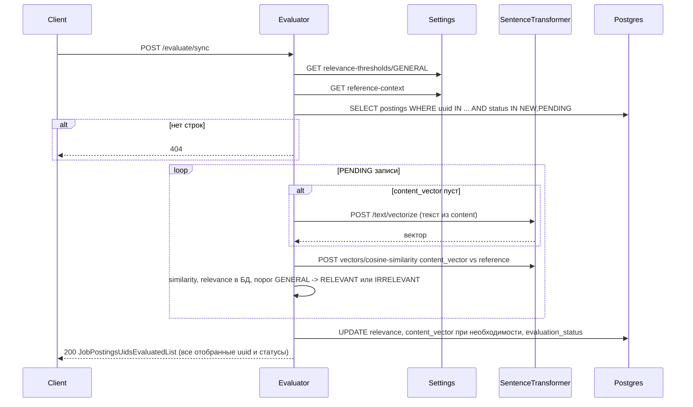

# job-postings-evaluator

Spring Boot-сервис автоматической оценки релевантности вакансий для Joposcragent. Реализует REST API и алгоритмы из каталога спецификаций `specifications/services/job-postings-evaluator/` (файлы `openapi.yaml` и `readme.md`).

## Как устроена синхронная оценка

Ниже — поток вызовов для `POST /evaluate/sync` (после отбора строк в БД).



Записи в статусе `NEW` попадают в ответ без изменения в БД; обрабатываются только `PENDING` по шагам выше. Если эталонный контекст не задан (`GET /reference-context` возвращает 202 или вектор пуст), запрос завершится ошибкой.

## Сборка

Требования: JDK 21, при сборке с генерацией JOOQ — доступная БД PostgreSQL с применёнными миграциями схемы `job_postings` (та же, что для `job-postings-crud`).

```bash
cd app/job-postings-evaluator
./gradlew build
```

Перед первой компиляцией Gradle выполнит `generateJooq` (подключение к БД по умолчанию: `jdbc:postgresql://localhost:5432/joposcragent`). При необходимости задайте:

- `JOOQ_DB_URL`, `JOOQ_DB_USER`, `JOOQ_DB_PASSWORD`

## Запуск локально

1. Поднимите PostgreSQL с БД `joposcragent` и сервисы `settings-manager` и `sentence-transformer` (или укажите их URL в конфигурации).
2. Задайте параметры подключения и интеграций, например:

```bash
export SPRING_DATASOURCE_URL=jdbc:postgresql://localhost:5432/joposcragent
export SPRING_DATASOURCE_USERNAME=postgres
export SPRING_DATASOURCE_PASSWORD=postgres
export JOPOSCRAGENT_SETTINGS_MANAGER_BASE_URL=http://localhost:8080
export JOPOSCRAGENT_SENTENCE_TRANSFORMER_BASE_URL=http://localhost:8000/sentence-transformer
./gradlew bootRun
```

## Отладка

- В IDE откройте проект как Gradle-модуль и запустите `JobPostingsEvaluatorApplication` с теми же переменными окружения или с `application-local.yml` (профиль `local` при необходимости добавьте сами).
- Эндпоинт здоровья: `GET /actuator/health` (при включённом actuator).
- Для точечной отладки REST используйте `POST /evaluate/sync` с телом `{"list":["<uuid-вакансии>"]}` — в логах Spring при необходимости включите `logging.level.org.springframework.web.client=DEBUG` для трассировки вызовов к внешним HTTP API.

## Образ контейнера

```bash
./gradlew bootBuildImage
```

Имя образа задаётся через переменные `IMAGE_NAME` и `IMAGE_TAG` (см. `build.gradle.kts`).
